## Global vs local smoothing parameters in ICAR

Using `brms` and `stan` to go beyond the global standard deviation
parameter of `mgcv` in intrinsic conditional autocorrelation spatial
structures.

This is the original model fitted using the `mgcv` package.

``` r

mgcv_icar <- gam(con_swing ~
                   degree_educated +
                   health_not_good +
                   white +
                   s(region, bs="re") +
                   s(degree_educated,region, bs="re") +
                   s(health_not_good,region, bs="re") +
                   s(white,region, bs="re") +
                   s(county, bs="re") +
                   s(degree_educated,county, bs="re") +
                   s(health_not_good,county, bs="re") +
                   s(white,county, bs="re") +
                   s(constituency_name, bs='mrf', xt=list(nb=nlistconst), k=311),
                 data=df_scaled, method="REML")
```

Its ICAR component is mapped below:

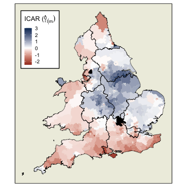

### Global standard deviation

#### brms using mgcv smooth icar

The specifications of the `mgcv` model can be reproduced in a Bayesian
framework using `brms`.

``` r

brms_icar_mgcv <- brm(con_swing ~ 1 + degree_educated +
                    health_not_good +
                    white +
                    (1 + degree_educated + health_not_good + white || region/county) +
                    s(constituency_name, bs='mrf', xt=list(nb=nlistconst), k=311),
                  data=df_scaled, cores = 4, iter = 6000, thin = 4,
                  silent = TRUE)
```

The resulting ICAR structure based on the posterior means is extremely
similar to that of the `mgcv` model:

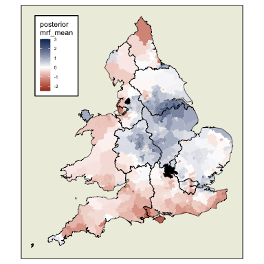

Some of the limitations of the `mgcv` model can be overcome in `brms`.
In the model below, correlation has additionally been allowed between
the random coefficients (by using \| instead of \|\|). This is not
possible with random effects in `mgcv`. Furthermore, this model is not
subject to the restriction of max(k)=311 from `mgcv`. By not specifying
any k, the full 571 x 571 covariance matrix is used.

``` r

brms_icar2 <- brm(con_swing ~ 1 + degree_educated +
                    health_not_good +
                    white +
                    (1 + degree_educated + health_not_good + white | region/county) +
                    s(constituency_name, bs='mrf', xt=list(nb=nlistconst)),
                  data=df_scaled, data2=list(W=W), cores = 4, iter = 8000, thin = 4,
                  silent = TRUE)
```

As is the case with greater values of k in an `mgcv` ICAR model using
*bs = mrf*, this decreases the level of smoothness:

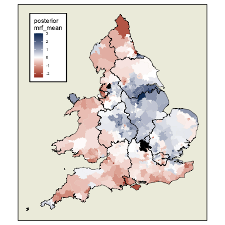

#### brms built-in icar

`brms` has the in-built capacity to set up different types of spatial
conditional autoregressive terms. Currently implemented are “escar”
(exact sparse CAR), “esicar” (exact sparse intrinsic CAR), “icar”
(intrinsic CAR), and “bym2”. The “escar” and “esicar” types are
implemented based on the case study of Max Joseph
(<https://github.com/mbjoseph/CARstan>). The “icar” and “bym2” type is
implemented based on the case study of Mitzi Morris
(<https://mc-stan.org/users/documentation/case-studies/icar_stan.html>).

The following model makes use of the *type = “icar”* component:

``` r

brms_icar <- brm(con_swing ~ 1 + degree_educated +
                   health_not_good +
                   white +
                   (1 + degree_educated + health_not_good + white || region/county) +
                   car(W, type = "icar", gr=constituency_name),
                 data=df_scaled, data2=list(W=W), cores = 4, iter = 6000, thin = 4,
                 silent = TRUE)
```

The following map shows posterior means of this *type = “icar”*
implementation. They are quite similar to those of `mgcv` but, again,
less smooth.

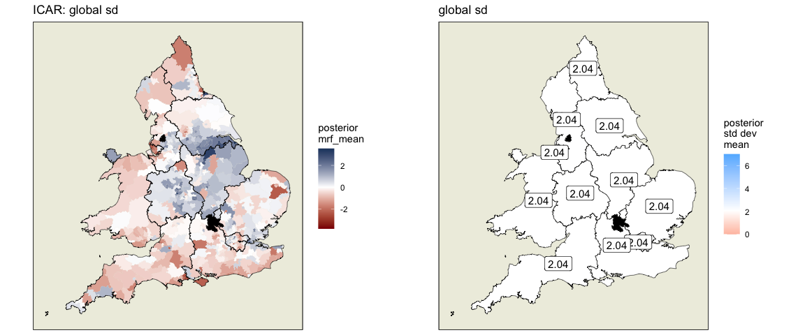

### Standard deviation by region

#### stan from brms with adaptations

By using the `brms` function *stancode()* to produce the `stan` code for
the above model, changes can be made to the `stan` code to allow for a
different standard deviation for each region. This code is shown below
with the alterations marked as commented lines.

``` r

## stan code
// generated with brms 2.19.0
data {
  int<lower=1> N;  // total number of observations
  vector[N] Y;  // response variable
  int<lower=1> K;  // number of population-level effects
  matrix[N, K] X;  // population-level design matrix
  // data for the CAR structure
  int<lower=1> Nloc;
  int<lower=1> Jloc[N];
  int<lower=0> Nedges;
  int<lower=1> edges1[Nedges];
  int<lower=1> edges2[Nedges];
  // data for group-level effects of ID 1
  int<lower=1> N_1;  // number of grouping levels
  int<lower=1> M_1;  // number of coefficients per level
  int<lower=1> J_1[N];  // grouping indicator per observation
  // group-level predictor values
  vector[N] Z_1_1;
  vector[N] Z_1_2;
  vector[N] Z_1_3;
  vector[N] Z_1_4;
  // data for group-level effects of ID 2
  int<lower=1> N_2;  // number of grouping levels
  int<lower=1> M_2;  // number of coefficients per level
  int<lower=1> J_2[N];  // grouping indicator per observation
  // group-level predictor values
  vector[N] Z_2_1;
  vector[N] Z_2_2;
  vector[N] Z_2_3;
  vector[N] Z_2_4;
  int prior_only;  // should the likelihood be ignored?
}
transformed data {
  int Kc = K - 1;
  matrix[N, Kc] Xc;  // centered version of X without an intercept
  vector[Kc] means_X;  // column means of X before centering
  for (i in 2:K) {
    means_X[i - 1] = mean(X[, i]);
    Xc[, i - 1] = X[, i] - means_X[i - 1];
  }
}
parameters {
  vector[Kc] b;  // population-level effects
  real Intercept;  // temporary intercept for centered predictors
##### alterations made here #################################################
  vector<lower=0> [N_1] sdcar;  // SD of the CAR structure
#############################################################################
  // parameters for the ICAR structure
  vector[N] zcar;
  real<lower=0> sigma;  // dispersion parameter
  vector<lower=0>[M_1] sd_1;  // group-level standard deviations
  vector[N_1] z_1[M_1];  // standardized group-level effects
  vector<lower=0>[M_2] sd_2;  // group-level standard deviations
  vector[N_2] z_2[M_2];  // standardized group-level effects
}
transformed parameters {
  // scaled parameters for the ICAR structure
  vector[N] rcar;
  vector[N_1] r_1_1;  // actual group-level effects
  vector[N_1] r_1_2;  // actual group-level effects
  vector[N_1] r_1_3;  // actual group-level effects
  vector[N_1] r_1_4;  // actual group-level effects
  vector[N_2] r_2_1;  // actual group-level effects
  vector[N_2] r_2_2;  // actual group-level effects
  vector[N_2] r_2_3;  // actual group-level effects
  vector[N_2] r_2_4;  // actual group-level effects
  real lprior = 0;  // prior contributions to the log posterior
##### alterations made here #################################################
  // compute scaled parameters for the ICAR structure
  for (n in 1:N) {
    rcar[n] = zcar[n] .* sdcar[J_1[n]];
  }
#############################################################################
  r_1_1 = (sd_1[1] * (z_1[1]));
  r_1_2 = (sd_1[2] * (z_1[2]));
  r_1_3 = (sd_1[3] * (z_1[3]));
  r_1_4 = (sd_1[4] * (z_1[4]));
  r_2_1 = (sd_2[1] * (z_2[1]));
  r_2_2 = (sd_2[2] * (z_2[2]));
  r_2_3 = (sd_2[3] * (z_2[3]));
  r_2_4 = (sd_2[4] * (z_2[4]));
  lprior += student_t_lpdf(Intercept | 3, 4.7, 3.1);
  lprior += student_t_lpdf(sdcar | 3, 0, 3.1)
    - 1 * student_t_lccdf(0 | 3, 0, 3.1);
  lprior += student_t_lpdf(sigma | 3, 0, 3.1)
    - 1 * student_t_lccdf(0 | 3, 0, 3.1);
  lprior += student_t_lpdf(sd_1 | 3, 0, 3.1)
    - 4 * student_t_lccdf(0 | 3, 0, 3.1);
  lprior += student_t_lpdf(sd_2 | 3, 0, 3.1)
    - 4 * student_t_lccdf(0 | 3, 0, 3.1);
}
model {
  // likelihood including constants
  if (!prior_only) {
    // initialize linear predictor term
    vector[N] mu = rep_vector(0.0, N);
    mu += Intercept + Xc * b;
    for (n in 1:N) {
      // add more terms to the linear predictor
      mu[n] += rcar[n] + r_1_1[J_1[n]] * Z_1_1[n] + r_1_2[J_1[n]] * Z_1_2[n] + r_1_3[J_1[n]] * Z_1_3[n] + r_1_4[J_1[n]] * Z_1_4[n] + r_2_1[J_2[n]] * Z_2_1[n] + r_2_2[J_2[n]] * Z_2_2[n] + r_2_3[J_2[n]] * Z_2_3[n] + r_2_4[J_2[n]] * Z_2_4[n];
    }
    target += normal_lpdf(Y | mu, sigma);
  }
  // priors including constants
  target += lprior;
  // improper prior on the spatial CAR component
  target += -0.5 * dot_self(zcar[edges1] - zcar[edges2]);
  // soft sum-to-zero constraint
  target += normal_lpdf(sum(zcar) | 0, 0.001 * Nloc);
  target += std_normal_lpdf(z_1[1]);
  target += std_normal_lpdf(z_1[2]);
  target += std_normal_lpdf(z_1[3]);
  target += std_normal_lpdf(z_1[4]);
  target += std_normal_lpdf(z_2[1]);
  target += std_normal_lpdf(z_2[2]);
  target += std_normal_lpdf(z_2[3]);
  target += std_normal_lpdf(z_2[4]);
}
generated quantities {
  // actual population-level intercept
  real b_Intercept = Intercept - dot_product(means_X, b);
  
  // Log likelihood for observed data
  vector[N] log_lik;
  for (n in 1:N) {
    log_lik[n] = normal_lpdf(Y[n] | b_Intercept + Xc[n] * b + rcar[n] +
                                      r_1_1[J_1[n]] * Z_1_1[n] +
                                      r_1_2[J_1[n]] * Z_1_2[n] +
                                      r_1_3[J_1[n]] * Z_1_3[n] +
                                      r_1_4[J_1[n]] * Z_1_4[n] +
                                      r_2_1[J_2[n]] * Z_2_1[n] +
                                      r_2_2[J_2[n]] * Z_2_2[n] +
                                      r_2_3[J_2[n]] * Z_2_3[n] +
                                      r_2_4[J_2[n]] * Z_2_4[n],
                                      sigma);
  }
}
```

The results (mapped below) suggest that constituencies in red regions
(Wales, the South West, the South East, the North West, and the East)
have lower standard deviations and are more likely to behave in similar
ways to their neighbours than is suggested by the global standard
deviation model. On the other hand, constituencies in blue regions
(London, Merseyside, the East Midlands, the West Midlands, Yorkshire &
The Humber, and the North East) are likely to behave in less similar
ways to their neighbours than the other model suggests.

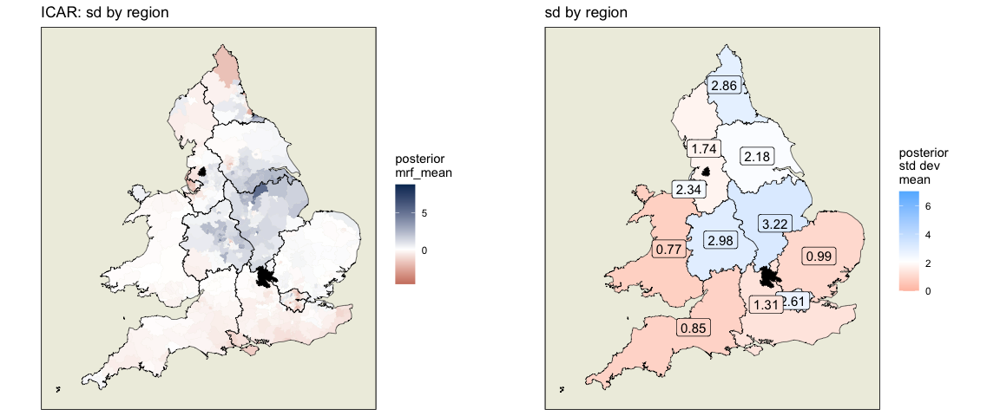

Ranking of regions within which neighbouring constituencies resemble
each other in swing behaviour from least similar (East Midlands) to most
(South West):

    ## # A tibble: 11 × 3
    ##    region                   sd_by_region relative_to_global_sd
    ##    <fct>                           <dbl>                 <dbl>
    ##  1 East Midlands                    3.22                  1.58
    ##  2 West Midlands                    2.98                  1.46
    ##  3 North East                       2.86                  1.4 
    ##  4 London                           2.61                  1.28
    ##  5 Merseyside                       2.34                  1.15
    ##  6 Yorkshire and The Humber         2.18                  1.07
    ##  7 North West                       1.74                  0.85
    ##  8 South East                       1.31                  0.64
    ##  9 East                             0.99                  0.49
    ## 10 South West                       0.85                  0.42
    ## 11 Wales                            0.77                  0.38

### Standard deviation by county

#### stan from brms with adaptations

The same can be done, by altering the indexing of the `stan` code
appropriately, to allow for a different standard deviation for each
county.

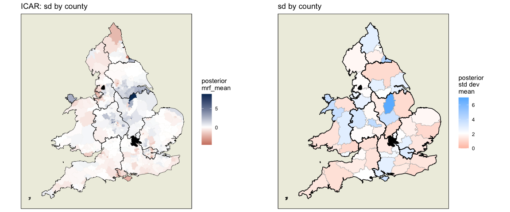

The 10 counties within which neighbouring constituencies least resemble
each other in swing behaviour:

    ## # A tibble: 10 × 4
    ##    county          region        sd_by_county relative_to_global_sd
    ##    <fct>           <fct>                <dbl>                 <dbl>
    ##  1 Nottinghamshire East Midlands         6.82                  3.34
    ##  2 Cleveland       North East            4.49                  2.2 
    ##  3 West Midlands   West Midlands         3.98                  1.95
    ##  4 Gwynedd         Wales                 3.72                  1.82
    ##  5 Leicestershire  East Midlands         3.59                  1.76
    ##  6 Isle of Wight   South East            3.53                  1.73
    ##  7 Shropshire      West Midlands         3.27                  1.6 
    ##  8 London          London                3.04                  1.49
    ##  9 Powys           Wales                 2.94                  1.44
    ## 10 Northumberland  North East            2.87                  1.41

The 10 counties within which neighbouring constituencies most resemble
each other in swing behaviour:

    ## # A tibble: 10 × 4
    ##    county                  region             sd_by_county relative_to_global_sd
    ##    <fct>                   <fct>                     <dbl>                 <dbl>
    ##  1 Wiltshire               South West                 1.28                  0.63
    ##  2 Clwyd                   Wales                      1.26                  0.62
    ##  3 Gloucestershire         South West                 1.22                  0.6 
    ##  4 Devon                   South West                 1.2                   0.59
    ##  5 Northamptonshire        East Midlands              1.1                   0.54
    ##  6 Lincolnshire            East Midlands              1.08                  0.53
    ##  7 North Yorkshire         Yorkshire and The…         1.07                  0.52
    ##  8 East Sussex             South East                 1.07                  0.52
    ##  9 Suffolk                 East                       1.01                  0.5 
    ## 10 Gwent and Mid Glamorgan Wales                      1.01                  0.5

Enlarged below are the mean posterior standard deviation values for each
county in this ICAR structure:

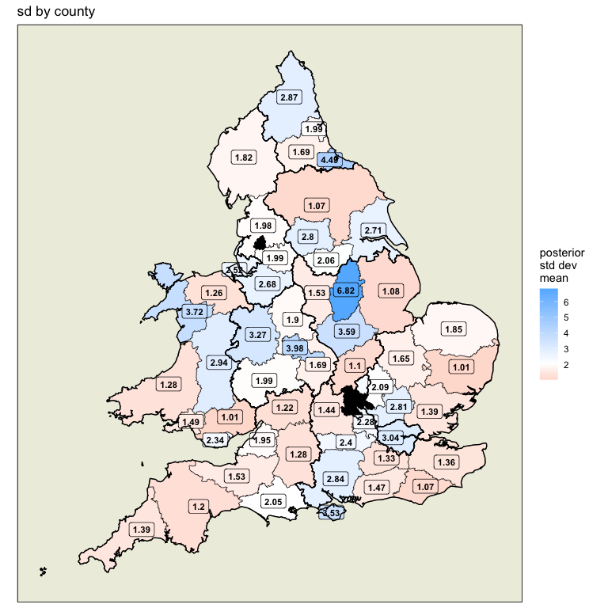

### Comparison of models

#### as projected maps

Below, the ICAR structures of these three models and their standard
deviations are presented side by side.

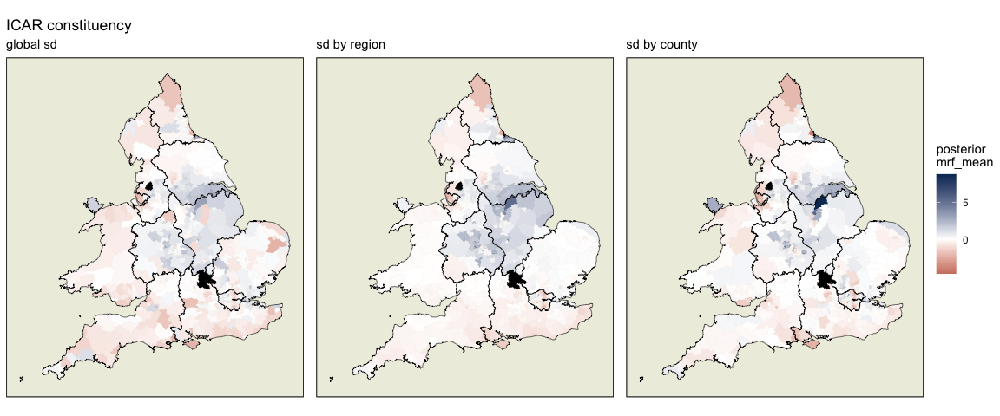

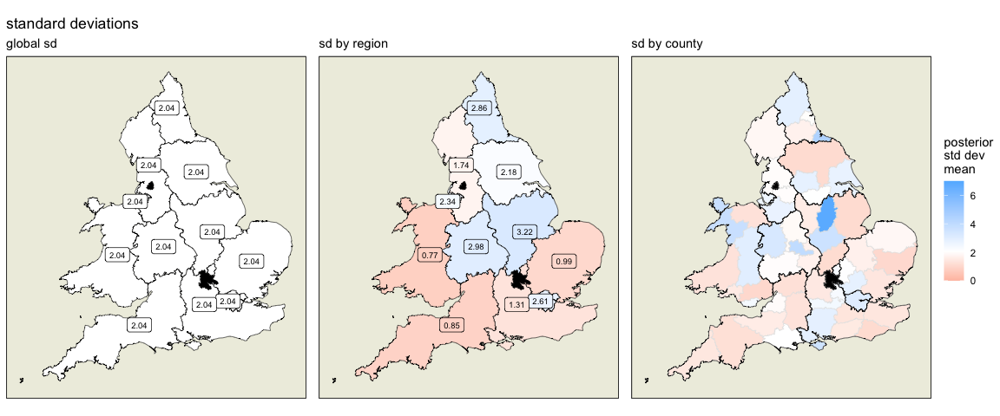

#### as cartograms

This format, where each pixel represents an equal population, gives
improved visibility of all of the constituencies

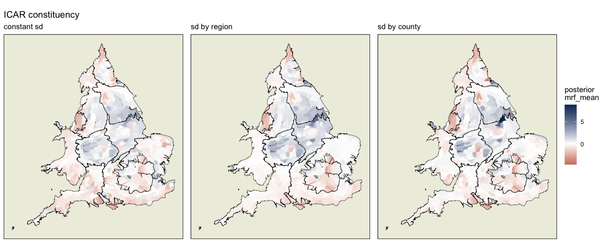

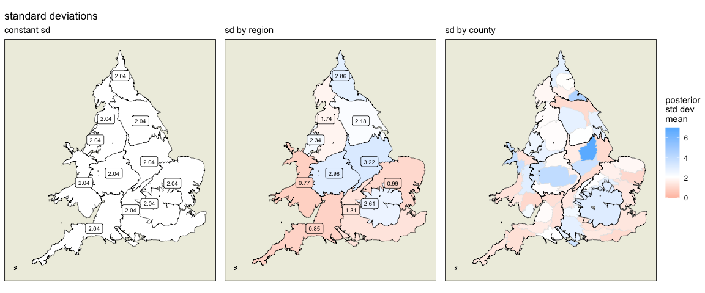

#### WAIC

The model with varying standard deviation by county has the best WAIC,
followed by the global model using the `brms` “icar” component, then the
model which varies by region. These three `brms` models which do not
feature `mgcv`-style components perform better than the bottom two which
are based on `mgcv`.

    ##                                      model std.dev.scale   WAIC relativeWIAC
    ## 1 brms with brms icar (with modified stan)        county 2262.9      1.00000
    ## 2                      brms with brms icar        global 2325.7      1.02775
    ## 3 brms with brms icar (with modified stan)        region 2335.5      1.03208
    ## 4              brms with mgcv icar (k=571)        global 2335.6      1.03213
    ## 5              brms with mgcv icar (k=311)        global 2370.7      1.04764
